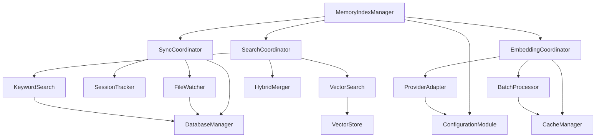

# Memory Manager Refactoring Plan

**Target**: Split Helios memory system for better maintainability and separation of concerns  
**Current Total**: 3,666 lines across core manager files  
**Status**: CRITICAL priority - system is functional but monolithic  

## Current Structure Analysis

### Core Files (Total: 3,666 lines)
```
manager.ts                 565 lines  - Main coordinator class
manager-sync-ops.ts      1,077 lines  - File watching, sync, database ops  
manager-embedding-ops.ts   786 lines  - Embeddings, batching, vector ops
manager-search.ts          187 lines  - Search implementations
internal.ts                336 lines  - Shared utilities
types.ts                    80 lines  - Type definitions
```

### Related Files
```
qmd-manager.ts           1,238 lines  - Query-based memory backend
embeddings.ts              257 lines  - Provider management
hybrid.ts                  115 lines  - Hybrid search logic
session-files.ts           131 lines  - Session file handling
```

### Current Architecture Issues
1. **Tight Coupling**: Main manager uses mixins combining sync and embedding ops
2. **Large Files**: Several files >700 lines violate maintainability guidelines  
3. **Mixed Responsibilities**: Single files handle multiple concerns (sync + database + watching)
4. **Hard to Test**: Monolithic classes make unit testing complex
5. **Difficult Extension**: Adding new features requires modifying large files

## Proposed Module Breakdown

### Phase 1: Core Separation

#### 1. **Configuration Module** (`config/`)
**Purpose**: Centralized configuration management  
**Extract From**: manager.ts (lines 45-150)  
**New Files**:
- `config/memory-config.ts` (80 lines)
- `config/provider-config.ts` (60 lines)  
- `config/cache-config.ts` (40 lines)

#### 2. **Database Layer** (`database/`)
**Purpose**: All database operations and schema management  
**Extract From**: manager-sync-ops.ts (lines 200-400)  
**New Files**:
- `database/connection-manager.ts` (120 lines)
- `database/schema-manager.ts` (100 lines)
- `database/query-builder.ts` (80 lines)

#### 3. **File System Operations** (`filesystem/`)
**Purpose**: File watching, scanning, and I/O operations  
**Extract From**: manager-sync-ops.ts (lines 400-800)  
**New Files**:
- `filesystem/file-watcher.ts` (150 lines)
- `filesystem/file-scanner.ts` (120 lines)  
- `filesystem/path-resolver.ts` (80 lines)

### Phase 2: Feature Separation

#### 4. **Synchronization Engine** (`sync/`)
**Purpose**: Coordinate file changes and database updates  
**Extract From**: manager-sync-ops.ts (lines 50-200, 800-1077)  
**New Files**:
- `sync/sync-coordinator.ts` (200 lines)
- `sync/progress-tracker.ts` (80 lines)
- `sync/conflict-resolver.ts` (60 lines)

#### 5. **Embedding Pipeline** (`embeddings/`)
**Purpose**: All embedding generation and caching  
**Extract From**: manager-embedding-ops.ts  
**New Files**:
- `embeddings/embedding-coordinator.ts` (150 lines)
- `embeddings/batch-processor.ts` (200 lines)
- `embeddings/cache-manager.ts` (120 lines)
- `embeddings/provider-adapter.ts` (100 lines)

#### 6. **Search Engine** (`search/`)
**Purpose**: All search implementations and ranking  
**Extract From**: manager-search.ts, manager.ts (search methods)  
**New Files**:
- `search/search-coordinator.ts` (120 lines)
- `search/vector-search.ts` (100 lines)
- `search/keyword-search.ts` (80 lines)
- `search/hybrid-merger.ts` (60 lines)

### Phase 3: Infrastructure

#### 7. **Session Management** (`sessions/`)
**Purpose**: Handle session-specific operations  
**Extract From**: manager-sync-ops.ts (session handling)  
**New Files**:
- `sessions/session-tracker.ts` (100 lines)
- `sessions/transcript-processor.ts` (80 lines)

#### 8. **Vector Operations** (`vector/`)
**Purpose**: Vector database interactions  
**Extract From**: manager-embedding-ops.ts (vector-specific code)  
**New Files**:
- `vector/vector-store.ts` (120 lines)
- `vector/similarity-calculator.ts` (60 lines)

## Dependency Graph



### Key Dependencies
- **Core → All**: Configuration and types flow to all modules
- **Search ← Embedding**: Search depends on embeddings being available
- **Sync → Database**: All sync operations require database access
- **FileWatcher → Sync**: File changes trigger sync operations

## Migration Order

### Phase 1: Foundation (Week 1)
1. **Extract Types and Utilities** (1 day)
   - Move `types.ts` → `core/types.ts`
   - Split `internal.ts` → utility modules
   - Ensure all imports work

2. **Create Configuration Module** (1 day)
   - Extract config handling from `manager.ts`
   - Test configuration loading
   - Update imports

3. **Database Layer Extraction** (2 days)
   - Move database operations to `database/`
   - Create connection manager
   - Test database operations

### Phase 2: Core Operations (Week 2)
4. **File System Operations** (2 days)
   - Extract file watching from sync ops
   - Create scanner module
   - Test file detection

5. **Synchronization Engine** (2 days)
   - Move sync coordination logic
   - Implement progress tracking
   - Test sync operations

### Phase 3: Advanced Features (Week 3)
6. **Embedding Pipeline** (2 days)
   - Extract embedding operations
   - Create batch processor
   - Test embedding generation

7. **Search Engine** (2 days)
   - Move search implementations
   - Create search coordinator
   - Test all search modes

### Phase 4: Polish (Week 4)
8. **Session Management** (1 day)
   - Extract session handling
   - Test session operations

9. **Integration Testing** (2 days)
   - Full system testing
   - Performance verification
   - Memory usage optimization

10. **Documentation** (1 day)
    - Update API documentation
    - Create architecture guide
    - Migration notes

## Implementation Strategy

### 1. Backward Compatibility
- Keep existing `MemoryIndexManager` as facade
- Gradually delegate to new modules
- Maintain all public APIs during transition

### 2. Testing Approach
- Extract with tests intact
- Add module-specific unit tests
- Integration tests for coordinator

### 3. Performance Considerations
- Monitor memory usage during refactor
- Lazy loading for heavy modules
- Connection pooling for database

### 4. Error Handling
- Centralized error handling in coordinators
- Graceful degradation for failed modules
- Comprehensive logging

## Expected Benefits

### Maintainability
- **Smaller Files**: No file >200 lines
- **Single Responsibility**: Each module has one clear purpose
- **Easier Testing**: Module isolation enables better unit tests

### Extensibility
- **Plugin Architecture**: Easy to add new embedding providers
- **Search Modes**: Simple to add new search algorithms  
- **Storage Backends**: Database abstraction allows new backends

### Performance
- **Lazy Loading**: Only load modules when needed
- **Better Caching**: Dedicated cache management
- **Parallel Operations**: Independent modules can work concurrently

## Risk Mitigation

### High Risk Areas
1. **Mixin Replacement**: Current prototype mixing is complex
2. **Database Schema**: Schema changes during migration
3. **File Watching**: Event handling during transition

### Mitigation Strategies
1. **Feature Flags**: Enable gradual rollout
2. **Rollback Plan**: Keep old implementation available  
3. **Staged Migration**: One module at a time
4. **Comprehensive Testing**: Before and after each phase

## Success Metrics

### Code Quality
- **File Size**: No file >200 lines
- **Cyclomatic Complexity**: <10 per function
- **Test Coverage**: >90% for new modules

### Performance
- **Startup Time**: <5% increase
- **Memory Usage**: <10% increase  
- **Search Latency**: No degradation

### Developer Experience
- **Build Time**: <20% increase
- **Hot Reload**: Maintain current speed
- **Debug Experience**: Improved module isolation

---

**Next Steps**: 
1. Review this plan with team
2. Create feature branch for refactoring
3. Begin Phase 1 implementation
4. Set up monitoring for performance regression